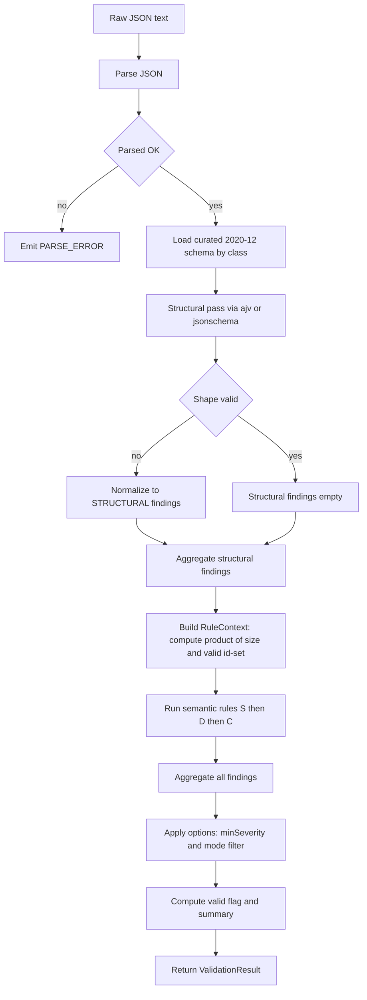
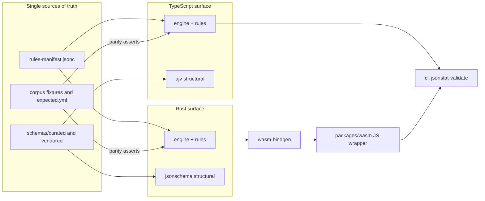
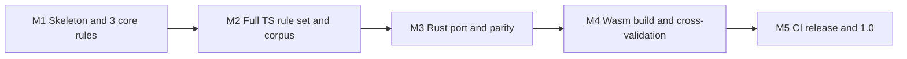
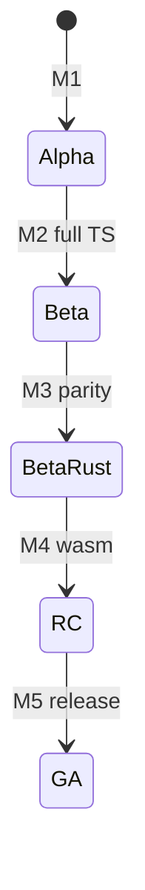

# `jsonstat-validator` — Technical Design & Project Plan

**Status:** Source-of-truth architecture for a new standalone package.
**Scope:** Planning only. No implementation code. Short illustrative signatures are included.
**Rule-sharing decision (confirmed):** Option B — one declarative `rules-manifest` is the single source of truth for the rule catalog, error codes, severities, and JSON-pointer/message templates; rule *logic* is hand-written in TypeScript and Rust; a *shared conformance corpus* enforces behavioral parity between the two runtimes.

---

## 0. TL;DR

`jsonstat-validator` is a **semantic** validator for JSON-stat 2.0. It does **not** reimplement structural validation — it **reuses** the official JSON Schema 2020-12 definitions (TS via `ajv`, Rust via the `jsonschema` crate) and layers on top a rules engine that checks the cross-field cube invariants JSON Schema cannot express (the S/D/C catalogue below). It ships as four interchangeable surfaces — a native TS package, a native Rust crate, a Wasm build with a JS wrapper, and a CLI — that are kept in lockstep by a single declarative manifest and one shared conformance corpus.

---

## 1. Goals & Non-goals

### Goals
- **G1 — Semantic layer only.** Implement the cross-field invariants JSON Schema cannot express (see §4 catalogue), on top of the official structural schemas.
- **G2 — Reuse, not reimplement, structural validation.** Delegate the structural pass to a 2020-12-capable engine: `ajv` (TS) and `jsonschema` (Rust). We never hand-roll shape checks.
- **G3 — Polyglot parity.** Native TS package **and** native Rust crate **and** a Wasm build + CLI + web entry. The two runtimes produce identical findings on identical input (enforced by tests, not by shared runtime code).
- **G4 — Stable, versioned error vocabulary.** A named, append-only error-code scheme versioned **independently** of the package SemVer.
- **G5 — Robust on large cubes.** Validate `us-labor.json`-class documents without OOM, with explicit budgets.
- **G6 — Interoperate, don't duplicate.** Position alongside [`jsonstat/toolkit`](https://github.com/jsonstat/toolkit) (data access) and [`jsonstat/wasm`](https://github.com/jsonstat/wasm) (Rust/Wasm data library) — see [`wiki/programming-libraries.md`](https://github.com/jsonstat/llm-wiki/blob/main/wiki/programming-libraries.md#L119). The validator is read-only and does not parse-for-access or convert.

### Non-goals
- **N1** Not a replacement for JSON Schema. We do not redefine per-class required properties, `oneOf`s, enums, or the IANA link regex — those live in [`raw/schema/dataset.json`](https://github.com/jsonstat/llm-wiki/blob/main/raw/schema/dataset.json#L324) et al.
- **N2** Not a data-access / conversion / editing library (that is the toolkit's and wasm lib's job).
- **N3** Not validating provider-specific [`extension`](https://github.com/jsonstat/llm-wiki/blob/main/wiki/extensions.md#L1) payloads (open object by design).
- **N4** Not validating the *statistical correctness* of values — only structural/semantic *consistency* of the document.
- **N5** Not fetching remote resources by default (configurable, budgeted — see §9 and open decision D2).

### Reuse-vs-reimplement decision (explicit)
The structural schemas are vendored, immutable, and standard 2020-12 ([`wiki/schema.md`](https://github.com/jsonstat/llm-wiki/blob/main/wiki/schema.md#L55)). Reimplementing their checks would (a) duplicate a maintained upstream artifact, (b) risk drift, and (c) waste effort on shape logic that a mature validator already does well. Therefore:

| Concern | Decision | Rationale |
|---|---|---|
| Per-class required props, `value`/`status`/`index` `oneOf`, role keys, `unit.position`, `coordinates` tuple, IANA link regex, `additionalProperties:false` | **Delegate to JSON Schema engine** | Already enforced by [`dataset.json`](https://github.com/jsonstat/llm-wiki/blob/main/raw/schema/dataset.json#L278) etc. |
| Cross-field cube invariants (S/D/C catalogue) | **Implement here** | JSON Schema cannot express field-vs-field relationships ([`wiki/schema.md`](https://github.com/jsonstat/llm-wiki/blob/main/wiki/schema.md#L69)) |
| Pre-2.0 bundle detection | **Implement here** (deprecation/info) | Out of 2.0-schema scope ([`wiki/response-classes.md`](https://github.com/jsonstat/llm-wiki/blob/main/wiki/response-classes.md#L114)) |

---

## 2. Repository layout & polyglot strategy

### Proposed monorepo

```
jsonstat-validator/
├─ packages/
│  ├─ ts/                    # @jsonstat-validator/ts  (native TS)
│  │  ├─ src/
│  │  │  ├─ index.ts         # public validate(...)
│  │  │  ├─ pipeline.ts      # parse -> structural -> semantic -> aggregate
│  │  │  ├─ structural/      # ajv 2020-12 wrapper + curated-schema loader
│  │  │  ├─ engine/          # registry, RuleContext, Finding, severity
│  │  │  ├─ rules/           # one file per rule, hand-written logic
│  │  │  ├─ manifest/        # imports ../../rules-manifest.jsonc
│  │  │  └─ types.ts
│  │  └─ test/               # unit + corpus-driven (shares ../corpus)
│  └─ wasm/                  # @jsonstat-validator/wasm  (JS wrapper over the crate)
│     └─ src/                # thin glue, same API shape as packages/ts
├─ crates/
│  └─ validator/             # jsonstat-validator  (lib + cdylib for wasm)
│     ├─ src/
│     │  ├─ lib.rs
│     │  ├─ pipeline.rs
│     │  ├─ structural.rs    # jsonschema crate wrapper
│     │  ├─ engine.rs        # registry, RuleContext, Finding
│     │  ├─ rules/           # one file per rule, hand-written logic
│     │  ├─ manifest.rs      # include_str! + serde of ../../rules-manifest.jsonc
│     │  └─ wasm.rs          # wasm-bindgen entry
│     └─ tests/              # unit + shared corpus
├─ cli/                      # jsonstat-validate (Node bin, shares packages/ts)
├─ rules-manifest.jsonc      # SINGLE SOURCE OF TRUTH (see §4)
├─ corpus/                   # shared conformance fixtures (input.json + expected.yml)
│  ├─ valid/
│  └─ invalid/<code-slug>/
├─ schemas/
│  ├─ vendored/              # immutable copy of raw/schema/* (quotable)
│  └─ curated/               # de-duplicated 2020-12 with $ref sharing (see §2.3)
├─ docs/
└─ .github/workflows/
```

### 2.1 How TS and Rust share the rules (Option B, detailed)

Three artifacts, three distinct roles:

1. **[`rules-manifest.jsonc`](rules-manifest.jsonc:1)** — single source of truth for *metadata*, not logic. Each entry pins the rule id (`S3`), the stable `code` (`VALUE_LEN_MISMATCH`), `severity`, `appliesTo` (dataset/dimension/collection), the `specRef` (wiki page + anchor), and the `message`/`pointer` templates. Loaded by **both** runtimes (TS: JSON import; Rust: `include_str!` + `serde`). This guarantees both surfaces emit *identical codes, severities, messages, and JSON-pointer shapes*.
2. **Hand-written rule logic** in each language (`packages/ts/src/rules/*`, `crates/validator/src/rules/*`). The manifest does **not** generate the predicate — that would be option A (rejected: codegen + DSL complexity, hard to debug). Each rule is a small, readable function `check(ctx) -> Vec<Finding>`.
3. **[`corpus/`](corpus:1)** — the *behavioral* single source of truth. Every fixture carries an `expected.yml` declaring the exact code multiset (and severities) it must produce. Both the TS and Rust test suites assert against the **same** expected files, so any divergence fails CI (the parity gate, §7).

> **Trade-off acknowledged (honest):** Option B does not *mechanically* prevent a TS dev and a Rust dev from writing subtly different predicates. It prevents *silent* divergence by (a) sharing the code/severity/message vocabulary via the manifest, and (b) sharing the expected outputs via the corpus parity gate. Where a rule is subtle, we add multiple corpus fixtures and, where cheap, a property test that both runtimes must satisfy identically.

### 2.2 Wasm binding approach
- `wasm-bindgen` + `wasm-pack`, built with `wasm-pack build --target web` (plus `nodejs`/`bundler` targets published as separate dist variants).
- Boundary uses `serde` + `serde-wasm-bindgen` to pass `JsValue` ↔ typed Rust structs. Expose `validate(doc: JsValue, options: JsValue) -> JsValue` returning a `ValidationResult` whose shape matches the TS surface exactly.
- [`packages/wasm`](packages/wasm/src:1) is a thin TS wrapper that re-exports the same `validate`/`validateFile` signatures as [`packages/ts`](packages/ts/src/index.ts:1) so consumers can swap implementations without touching call sites.

### 2.3 Schema de-duplication — recommendation
The four vendored files duplicate `$defs` (`strarray`, `category`, `link`, `unit`, `coordinates`, `updated`, …) byte-for-byte with **no cross-file `$ref`**, and [`index.json`](https://github.com/jsonstat/llm-wiki/blob/main/raw/schema/index.json#L227) additionally re-inlines the full per-class property sets inside its `oneOf` (confirmed by reading all four; also noted in [`wiki/schema.md`](https://github.com/jsonstat/llm-wiki/blob/main/wiki/schema.md#L51)). Any correction today must be applied to all files in lockstep.

**Recommendation: ship a curated, de-duplicated set, keep vendored originals as the quote source.**

- [`schemas/vendored/`](schemas/vendored:1) — verbatim copies of [`raw/schema/*`](https://github.com/jsonstat/llm-wiki/blob/main/raw/schema:1). Untouched. This is what we point at to *prove* we haven't drifted from upstream.
- [`schemas/curated/`](schemas/curated:1) — a `core.json` that declares the shared `$defs` **once** under a stable `$id`, plus `dataset.json`/`collection.json`/`dimension.json`/`index.json` that `$ref` into `core.json`. The validator loads **curated** by default.
- **Guard:** a CI test validates the entire corpus against *both* curated and vendored and asserts identical outcomes, so de-duplication can never silently change semantics. This realizes improvement #1 suggested in [`wiki/schema.md`](https://github.com/jsonstat/llm-wiki/blob/main/wiki/schema.md#L100).

---

## 3. Rule engine architecture

### 3.1 Components
- **`RuleRegistry`** — built once at startup from [`rules-manifest.jsonc`](rules-manifest.jsonc:1). Each entry exposes a stable `code`, `ruleId`, `severity`, `appliesTo`, and a `check` function.
- **`RuleContext`** — the immutable-ish bundle handed to each rule: a typed read-only view of the parsed document, the structural-validation result, resolved options, a JSON-pointer builder, and budget counters (cells visited, findings emitted, recursion depth).
- **`Rule` contract** — `check(ctx) -> Finding[]` (synchronous, pure). Rules must not mutate the document or each other's state; ordering is advisory, not correctness-relevant.
- **`FindingEmitter`** — optional streaming sink (`onFinding`) so very large documents can emit incrementally without buffering (see §9).

### 3.2 Ordering & guard rails
Ordering by phase: **dataset-level (S) → dimension-level (D, per dimension) → cross-level (C)**. Most rules are independent. Two coupling rules:
- If the **structural** pass fails, semantic rules that assume shape (e.g. S3 needs `value` to be an array; D1 needs `index` to be an array) run in a **degraded** mode guarded by `options.continueOnStructuralError` (default `true`): a rule silently no-ops when its precondition shape is absent, rather than throwing. This avoids cascading noise.
- `id`/`size` invariants (S1, S2) are evaluated **first** because later rules (S3, S5, D1) consume their results (e.g. the `product(size)` and the valid id-set) — computed once in the context.

### 3.3 Validate pipeline (flow)



> Note: nodes use simple labels; the `ajv`/`jsonschema` choice is a runtime detail, not branching logic.

### 3.4 System architecture (components)



---

## 4. Error model & named error-code vocabulary

### 4.1 Severity levels
- **`error`** — document is internally inconsistent; `valid === false`.
- **`warning`** — recommended practice violated; `valid` unaffected (e.g. S8).
- **`info`** — informational, including the **`deprecation`** subtype for pre-2.0 bundles (C2).
- A `valid === true` requires **zero `error`-severity findings** (subject to `options.minSeverity` filtering only for *what is returned*, not for the `valid` computation).

### 4.2 Structured `Finding` object
```jsonc
{
  "code": "VALUE_LEN_MISMATCH",
  "ruleId": "S3",
  "severity": "error",
  "path": "/value",                       // RFC 6901 JSON pointer
  "message": "Dense value length 431 must equal product(size) = 1*36*12 = 432.",
  "expected": 432,
  "actual": 431,
  "specRef": "wiki/dataset-structure.md#value"
}
```
Structural (JSON Schema) violations are normalized into the **same** shape with `code: "STRUCTURAL_VIOLATION"`, `severity: "error"`, the offending pointer in `path`, and the underlying schema keyword (e.g. `required`, `oneOf`, `enum`) preserved in a `meta` field — so consumers need only one finding shape.

### 4.3 `ValidationResult` API shape
```jsonc
{
  "valid": false,
  "findings": [ /* Finding[] */ ],
  "summary": {
    "errors": 1, "warnings": 0, "infos": 0,
    "structuralErrors": 0,
    "byCode": { "VALUE_LEN_MISMATCH": 1 }
  },
  "options": { /* resolved ValidateOptions */ },
  "meta": {
    "engineVersion": "0.4.1",
    "ruleSetVersion": "1.0.0",
    "schemaVersion": "1.05",     // vendored 2020-12 schema version
    "durationMs": 3.2
  }
}
```

### 4.4 Named error-code catalogue (authoritative)

> Source column cites the wiki page where the invariant is specified. `appliesTo` restricts a rule to the relevant response class.

| Rule | Code | Severity | Applies to | What it checks | Source |
|---|---|---|---|---|---|
| S1 | `ID_SIZE_LEN_MISMATCH` | error | dataset | `len(id) == len(size)` | [`dataset-structure`](https://github.com/jsonstat/llm-wiki/blob/main/wiki/dataset-structure.md#L26) |
| S2 | `DIM_KEY_ID_MISMATCH` | error | dataset | keys of `dimension` ≡ values of `id` (set-equality) | [`dataset-structure`](https://github.com/jsonstat/llm-wiki/blob/main/wiki/dataset-structure.md#L32) |
| S3 | `VALUE_LEN_MISMATCH` | error | dataset | dense `value`: `len(value) == product(size)` | [`format-specification`](https://github.com/jsonstat/llm-wiki/blob/main/wiki/format-specification.md#L55) |
| S4 | `SPARSE_KEY_OUT_OF_RANGE` | error | dataset | sparse `value`/`status` keys are integers in `[0, product(size)-1]` | [`sparse-cubes`](https://github.com/jsonstat/llm-wiki/blob/main/wiki/sparse-cubes.md#L30) |
| S5 | `ROLE_ID_UNKNOWN` | error | dataset | `role.{time,geo,metric}` ⊆ `id` | [`dimensions`](https://github.com/jsonstat/llm-wiki/blob/main/wiki/dimensions.md#L48) |
| S6 | `STATUS_LEN_MISMATCH` | error | dataset | array `status`: `len == product(size)` | [`dataset-structure`](https://github.com/jsonstat/llm-wiki/blob/main/wiki/dataset-structure.md#L71) |
| S7 | `STATUS_KEY_OUT_OF_RANGE` | error | dataset | object `status` keys are valid cell positions (same as S4) | [`dataset-structure`](https://github.com/jsonstat/llm-wiki/blob/main/wiki/dataset-structure.md#L71) |
| S8 | `METRIC_UNIT_MISSING` | warning | dataset | every `role.metric` dimension has a non-empty `category.unit` | [`dimensions`](https://github.com/jsonstat/llm-wiki/blob/main/wiki/dimensions.md#L72) |
| D1 | `INDEX_COUNT_MISMATCH` | error | dimension | array `category.index`: count == `size` (unique IDs already enforced structurally via `uniqueItems`) | [`dimensions`](https://github.com/jsonstat/llm-wiki/blob/main/wiki/dimensions.md#L87) |
| D2 | `INDEX_POSITIONS_INVALID` | error | dimension | object `category.index`: values are a permutation of `[0, size-1]` | [`dimensions`](https://github.com/jsonstat/llm-wiki/blob/main/wiki/dimensions.md#L87) |
| D3 | `LABEL_KEY_UNKNOWN` | error / warning | dimension | `category.label` keys ⊆ index IDs; *unknown* → error, *proper subset* → `LABEL_KEY_INCOMPLETE` warning | [`dimensions`](https://github.com/jsonstat/llm-wiki/blob/main/wiki/dimensions.md#L113) |
| D4 | `UNIT_KEY_UNKNOWN` | error | dimension | `category.unit` keys ⊆ index IDs | [`dimensions`](https://github.com/jsonstat/llm-wiki/blob/main/wiki/dimensions.md#L158) |
| D5 | `COORD_KEY_UNKNOWN` | error | dimension | `category.coordinates` keys ⊆ index IDs | [`dimensions`](https://github.com/jsonstat/llm-wiki/blob/main/wiki/dimensions.md#L144) |
| D6 | `NOTE_KEY_UNKNOWN` | error | dimension | `category.note` keys ⊆ index IDs | [`dimensions`](https://github.com/jsonstat/llm-wiki/blob/main/wiki/dimensions.md#L67) |
| D7 | `CHILD_ID_UNKNOWN` | error | dimension | every parent/child id in `category.child` is a valid index ID | [`dimensions`](https://github.com/jsonstat/llm-wiki/blob/main/wiki/dimensions.md#L130) |
| D7 | `CHILD_CYCLE` | error | dimension | the parent→child graph is acyclic | [`dimensions`](https://github.com/jsonstat/llm-wiki/blob/main/wiki/dimensions.md#L130) |
| C1 | `RECURSION_LIMIT` | info | collection | collection recursion depth exceeded the configured budget | [`links`](https://github.com/jsonstat/llm-wiki/blob/main/wiki/links.md#L80) |
| C2 | `BUNDLE_DEPRECATED` | info | any | pre-2.0 bundle response detected | [`response-classes`](https://github.com/jsonstat/llm-wiki/blob/main/wiki/response-classes.md#L114) |
| — | `CUBE_SIZE_OVERFLOW` | error | dataset | `product(size)` overflows the engine's integer range (guards S3/S6/S4 against OOM) | perf guard, §9 |
| — | `PARSE_ERROR` | error | any | input is not valid JSON | — |
| — | `STRUCTURAL_VIOLATION` | error | any | JSON Schema 2020-12 violation (keyword retained in `meta`) | [`schema`](https://github.com/jsonstat/llm-wiki/blob/main/wiki/schema.md#L55) |

### 4.5 Error-code versioning (independent of package SemVer)
- The manifest declares `ruleSetVersion` (its own SemVer), **separate** from the npm/crates package version.
- **Stability policy** (within a `ruleSetVersion` major):
  - Codes are **append-only**. A code is never renamed.
  - Severity may move `warning → error` only in a **minor** bump (documented in a machine-readable `rules-changelog`).
  - Removing/retiring a code = **major** ruleSet bump.
- `meta.ruleSetVersion` is always present in results so downstream tooling can branch on the vocabulary, not on the package version.

---

## 5. Public API

### 5.1 TypeScript (`@jsonstat-validator/ts`)
```ts
export interface ValidateOptions {
  mode?: "full" | "structural" | "semantic";        // default "full"
  minSeverity?: "error" | "warning" | "info";       // filters returned findings (default "info" = all)
  maxCollectionDepth?: number;                       // default 3; 0 disables C1 recursion
  fetchRemote?: boolean;                             // default false (D2)
  budget?: { maxCells?: number; maxBytes?: number; timeoutMs?: number };
  continueOnStructuralError?: boolean;               // default true
  onFinding?: (f: Finding) => void;                  // streaming sink
}
export function validate(doc: unknown, options?: ValidateOptions): ValidationResult;
export function validateFile(path: string, options?: ValidateOptions): Promise<ValidationResult>;
```

### 5.2 Rust (`jsonstat-validator` crate)
```rust
pub struct ValidateOptions { /* mirror of the TS options */ }
pub fn validate(doc: &serde_json::Value, options: &ValidateOptions) -> ValidationResult;
pub fn validate_from_str(json: &str, options: &ValidateOptions)
    -> Result<ValidationResult, ValidatorError>;
```

### 5.3 Wasm / web entrypoint (`@jsonstat-validator/wasm`)
Same signatures as TS, asynchronously initialized:
```ts
import { validate } from "@jsonstat-validator/wasm";
await init();                  // loads the .wasm module once
const result = validate(doc, { mode: "full" });
```

### 5.4 CLI
```
jsonstat-validate <file|url|-> [options]
  --mode structural|semantic|full
  --format json|text|sarif
  --min-severity error|warning|info
  --max-collection-depth <n>
  --no-remote
  --budget-cells <n>
```
Exit code `0` when `valid === true`, else `1`. Reads from a path, a URL, or stdin (`-`).

### 5.5 Example output (JSON)
```json
{
  "valid": false,
  "findings": [
    {
      "code": "VALUE_LEN_MISMATCH",
      "ruleId": "S3",
      "severity": "error",
      "path": "/value",
      "message": "Dense value length 431 must equal product(size) = 1*36*12 = 432.",
      "expected": 432,
      "actual": 431,
      "specRef": "wiki/dataset-structure.md#value"
    }
  ],
  "summary": { "errors": 1, "warnings": 0, "infos": 0, "structuralErrors": 0,
               "byCode": { "VALUE_LEN_MISMATCH": 1 } },
  "meta": { "engineVersion": "0.4.1", "ruleSetVersion": "1.0.0",
            "schemaVersion": "1.05", "durationMs": 3.2 }
}
```

---

## 6. Conformance corpus strategy

### 6.1 Layout
```
corpus/
├─ INDEX.yml                       # sample -> expectation map
├─ valid/
│  ├─ oecd/input.json              # derived from canonical samples
│  ├─ canada/input.json
│  ├─ oecd-canada-col/input.json
│  ├─ galicia/input.json
│  ├─ order/input.json
│  ├─ hierarchy/input.json
│  ├─ us-gsp/input.json
│  ├─ us-unr/input.json
│  ├─ us-labor/input.json          # large-cube stress
│  └─ collection/input.json
└─ invalid/
   ├─ value-len-mismatch/{input.json,expected.yml}
   ├─ sparse-key-out-of-range/{input.json,expected.yml}
   ├─ dim-key-id-mismatch/{input.json,expected.yml}
   └─ ...                          # one minimal fixture per code, plus combos
```

### 6.2 Valid fixtures — derived from canonical samples
The 10 canonical samples in [`wiki/sample-files.md`](https://github.com/jsonstat/llm-wiki/blob/main/wiki/sample-files.md#L17) are the **positive** fixtures: each must produce **zero** error-severity findings. Their distinct features map to the rules they *exercise-but-pass*:

| Sample | Exercises (positively) |
|---|---|
| `oecd`, `canada` | S1–S7 baseline dataset cube |
| `oecd-canada-col`, `collection` | C1 embedded-collection recursion |
| `galicia` (6 dims) | S2/D1/D2 across many dimensions |
| `order` | S3 dense-length + row-major correctness |
| `hierarchy` | D7 `child` acyclicity |
| `us-gsp` | S5/S8 metric role + `unit` |
| `us-unr` | D3–D6 rich mappings |
| `us-labor` | large-cube performance guard (§9) |

### 6.3 Invalid fixtures — one minimal case per code
Each invalid fixture is the **smallest** document that triggers exactly its target code(s), to make failures debuggable. Examples:

| Fixture | Must trigger |
|---|---|
| `id-size-len-mismatch` | `ID_SIZE_LEN_MISMATCH` |
| `dim-key-id-mismatch` | `DIM_KEY_ID_MISMATCH` |
| `value-len-mismatch` | `VALUE_LEN_MISMATCH` |
| `sparse-key-out-of-range` | `SPARSE_KEY_OUT_OF_RANGE` |
| `role-id-unknown` | `ROLE_ID_UNKNOWN` |
| `status-len-mismatch` | `STATUS_LEN_MISMATCH` |
| `index-count-mismatch` | `INDEX_COUNT_MISMATCH` |
| `index-positions-invalid` | `INDEX_POSITIONS_INVALID` |
| `label-key-unknown` | `LABEL_KEY_UNKNOWN` |
| `unit-key-unknown` | `UNIT_KEY_UNKNOWN` |
| `coord-key-unknown` | `COORD_KEY_UNKNOWN` |
| `note-key-unknown` | `NOTE_KEY_UNKNOWN` |
| `child-id-unknown` | `CHILD_ID_UNKNOWN` |
| `child-cycle` | `CHILD_CYCLE` |
| `bundle-deprecated` | `BUNDLE_DEPRECATED` (info) |
| `metric-unit-missing` | `METRIC_UNIT_MISSING` (warning) |

A few **combination** fixtures assert multiple codes fire together (e.g. a sparse `value` with one out-of-range key *and* a `status` array of wrong length).

### 6.4 Manifest format per fixture
`expected.yml` (parsed by both TS and Rust test harnesses):
```yaml
appliesTo: dataset
structuralOk: true          # must pass structural JSON Schema first
expect:
  codes: [VALUE_LEN_MISMATCH]
  minCounts: { VALUE_LEN_MISMATCH: 1 }
severity: { error: 1 }
```
Assertion rule: the produced finding codes must **include** every code in `expect.codes` with at least `minCounts`, contain **no** error-severity code outside the expected set, and match `severity` totals. (Allowing extra *warnings/infos* only when explicitly permitted by the fixture.)

---

## 7. Testing strategy

1. **Unit tests per rule** — in both [`packages/ts`](packages/ts/src/rules:1) and [`crates/validator`](crates/validator/src/rules:1). Each rule has focused tests for the pass case and each failure case.
2. **Corpus-driven end-to-end** — both runtimes iterate [`corpus/`](corpus:1) and assert against each `expected.yml` (§6.4).
3. **Cross-runtime parity test (the Option-B safety net)** — a single CI job builds both surfaces, runs the **entire** shared corpus through each, and diffs the normalized finding sets (`code` + `severity` + `path`). Any difference fails the build. This is what makes "hand-written logic in two languages" safe.
4. **Property / fuzz testing** — generate random valid cubes from a generator, then apply structured mutations (drop a `value`, flip a `size`, insert a stray `label` key, add a `child` cycle) and assert that either the document stays valid or a **specific** code fires, identically in both runtimes. Special focus on sparse-key range edge cases and large `product(size)` overflow.
5. **Cross-validation vs the web validator** — run the corpus's structural expectations through the existing web **JSON-stat Format Validator** referenced in [`wiki/schema.md`](https://github.com/jsonstat/llm-wiki/blob/main/wiki/schema.md#L88) / [`wiki/tools-ecosystem.md`](https://github.com/jsonstat/llm-wiki/blob/main/wiki/tools-ecosystem.md#L122) to confirm our structural pass agrees with the reference implementation on shape.

---

## 8. CI/CD, packaging & release

### 8.1 GitHub Actions matrix
- **TS job** — Node 18/20/22: install, build, lint, unit + corpus tests, schema curated-vs-vendored parity.
- **Rust job** — stable + beta toolchains: `cargo build/test`, `cargo clippy -D warnings`, `cargo fmt --check`, corpus tests.
- **Wasm job** — `wasm-pack build` + `wasm-pack test --headless` (Chrome).
- **Parity job** — builds both, runs the shared corpus through both, diffs findings (§7.3).
- **Release job** — on git tag: publish npm packages, publish crate, attach CLI binaries.

### 8.2 Packaging
- npm: `@jsonstat-validator/ts`, `@jsonstat-validator/wasm`, and `jsonstat-validate` (CLI bin). Ship ESM + CJS + `.d.ts`.
- crates.io: `jsonstat-validator` (lib) and an optional `jsonstat-validator-cli` binary crate; release GitHub assets for standalone CLI.
- Wasm artifacts published as versioned `.wasm` + JS glue; consider a CDN/UNPKG entry.

### 8.3 SemVer & versioning policy
- **Package SemVer** — normal major/minor/patch for API changes.
- **`ruleSetVersion`** — independent SemVer for the error-code vocabulary (§4.5). Codes append-only within a major; severity tightening is a minor; code removal is a major.
- A `CHANGELOG.md` plus a machine-readable `rules-changelog.json` track both. Releases are cut from signed git tags.

---

## 9. Performance & robustness

- **Overflow guard first.** Compute `product(size)` with overflow detection before S3/S6/S4; on overflow emit `CUBE_SIZE_OVERFLOW` and skip the count-based rules rather than allocating (prevents OOM on hostile input).
- **Lazy traversal, no cell materialization.** Iterate dense `value`/`status` by length (O(1) count where possible) and sparse objects by key — never build a full `[0, n)` index array. For `us-labor.json`-class documents the working set stays bounded.
- **Streaming JSON.** Rust path may use `simd-json` / streaming deserialization for very large inputs; TS path uses a chunked/async reader for `validateFile`. The `onFinding` sink (§5.1) lets callers consume findings incrementally.
- **Budgets.** `options.budget` (`maxCells`, `maxBytes`, `timeoutMs`) and `maxCollectionDepth` bound work; exceeding a budget yields an `info`/`warning` (`RECURSION_LIMIT`, `BUDGET_EXCEEDED`) rather than hanging or crashing.
- **Finding cap.** `maxFindings` (default e.g. 1000) prevents pathological output; surplus findings are summarized in `summary.truncated`.
- **Typed arrays.** The validator is read-only and does not need to materialize data into typed arrays (unlike the toolkit, [`wiki/programming-libraries.md`](https://github.com/jsonstat/llm-wiki/blob/main/wiki/programming-libraries.md#L24)); this keeps memory minimal.

---

## 10. Licensing & governance

- **License: Apache-2.0** — matches [`jsonstat/toolkit`](https://github.com/jsonstat/toolkit) and most JSON-stat libs ([`wiki/programming-libraries.md`](https://github.com/jsonstat/llm-wiki/blob/main/wiki/programming-libraries.md#L17)); compatible with depending on the MIT-licensed [`jsonstat/wasm`](https://github.com/jsonstat/wasm) ([`wiki/programming-libraries.md`](https://github.com/jsonstat/llm-wiki/blob/main/wiki/programming-libraries.md#L121)).
- **Governance:** `CONTRIBUTING.md`, `CODE_OF_CONDUCT.md`, conventional-commits + either `changesets` or `release-please`, and signed release tags. CI enforces lint/fmt/parity before merge.

---

## 11. Phased roadmap (Phase B)

Milestones are ordered; each is independently shippable and lists its dependency.

| Milestone | Scope | Ships | Depends on |
|---|---|---|---|
| **M1 — Skeleton + 3 core rules** | Repo, [`packages/ts`](packages/ts:1), [`schemas/curated`](schemas/curated:1) + vendored parity, [`rules-manifest.jsonc`](rules-manifest.jsonc:1), ajv structural pass, rules **S1/S2/S3**, minimal corpus, CLI smoke | alpha | — |
| **M2 — Full TS rule set + corpus** | S1–S8, D1–D7, C1–C2 in TS; full valid+invalid corpus; locked error-code table; complete CLI | beta | M1 |
| **M3 — Rust port + parity** | Hand-written Rust rules; `jsonschema` structural; shared-corpus parity test green | beta (Rust) | M2 (manifest + corpus frozen) |
| **M4 — Wasm + cross-validation** | `wasm-pack` build + web wrapper; wasm tests; cross-validation vs web validator | RC | M3 |
| **M5 — CI/release + 1.0** | Full Actions matrix + parity gate; npm + crates.io publish; docs; SemVer + `ruleSetVersion` policy; `validator.md` wiki page | 1.0 | M4 |

### Roadmap timeline (dependencies)



### Milestone state machine (shippability)



---

## 12. Integration with the LLM-Wiki

Once implemented, reflect the project back into this knowledge base:
- **New page** [`wiki/validator.md`](https://github.com/jsonstat/llm-wiki/blob/main/wiki/validator.md#L1) — documents the package, install/usage (TS/Rust/Wasm/CLI), the error-code catalogue, the `ruleSetVersion` policy, and links to [`wiki/schema.md`](https://github.com/jsonstat/llm-wiki/blob/main/wiki/schema.md#L1).
- **Cross-link from** [`wiki/schema.md`](https://github.com/jsonstat/llm-wiki/blob/main/wiki/schema.md#L84) — the "semantic layer" paragraph points to `validator.md` as the realization of the proposed rules engine.
- **Cross-link from** [`wiki/tools-ecosystem.md`](https://github.com/jsonstat/llm-wiki/blob/main/wiki/tools-ecosystem.md#L120) — add `jsonstat-validator` under **Validation Tools** alongside the web validator and the official schemas.
- **Log entry** in [`wiki/log.md`](https://github.com/jsonstat/llm-wiki/blob/main/wiki/log.md#L1) — records the planning decision (Option B), the phased roadmap, and each milestone as it ships.

---

## 13. Open decisions needing sign-off before Phase B

- **D1 — Schema ownership.** Ship curated de-duplicated 2020-12 schemas (with `core.json` `$ref` sharing) and guard with a curated≡vendored parity test *(recommended)*, vs validate strictly against the vendored originals only.
- **D2 — Collection recursion & remote fetch (C1).** Default to **embedded-only** validation, depth-capped, with unresolved external `href`s reported as `info`; remote fetching opt-in behind `fetchRemote` with a budget *(recommended)*, vs always-off, vs always-fetch.
- **D3 — Pre-2.0 bundles (C2).** Detect and emit `BUNDLE_DEPRECATED` (info) + best-effort back-compat validation behind a flag *(recommended)*, vs strict reject-as-invalid, vs detect-and-skip silently.
- **D4 — Severity of S8.** Treat a metric-role dimension missing `unit` as a **warning** *(recommended)*, vs info-only.
