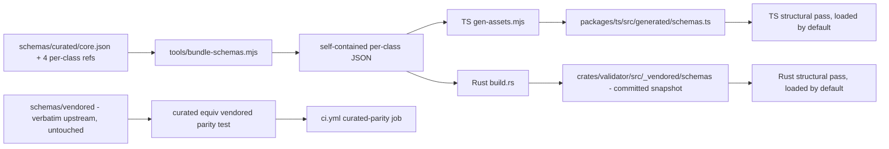
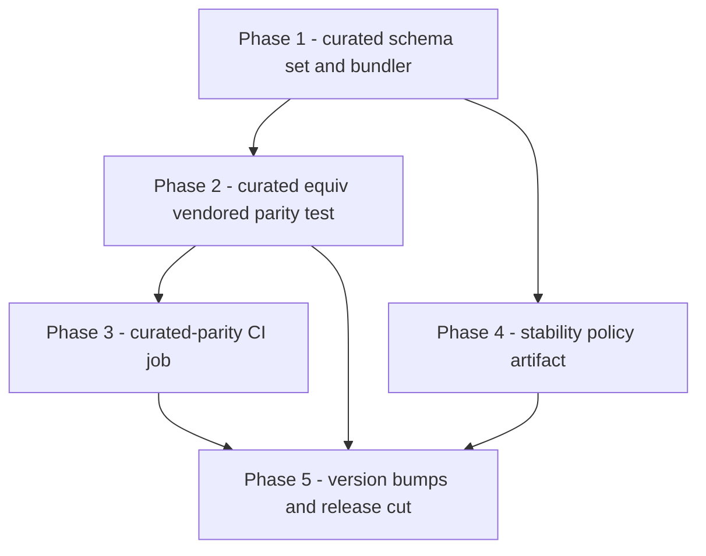

# Plan — jsonstat-validator `1.0.0` cut

Closes the three "Toward 1.0.0" items tracked in [`README.md`](../README.md) §Status and performs the
full release cut. The three tracked items map 1:1 to [`DESIGN.md`](../DESIGN.md):

| README bullet | DESIGN anchor | Deliverable |
|---|---|---|
| `schemas/curated/` de-duplicated set + parity test | [§2.3](../DESIGN.md) | curated schemas + corpus-curated≡vendored guard |
| curated-parity CI job | [§8.1](../DESIGN.md) | new CI job in `ci.yml` |
| written SemVer / `ruleSetVersion` stability policy | [§4.5](../DESIGN.md), [§8.3](../DESIGN.md) | committed policy artifact |

Plus the release cut itself: version bumps across all surfaces, `CHANGELOG` 1.0.0 section, README
Status/Versioning rewrite, and the single-commit `rules-manifest`↔`_vendored` sync enforced by
[`vendored_parity.rs`](../crates/validator/tests/vendored_parity.rs).

---

## Key design decision — how curated schemas are loaded

**Constraint.** The Rust crate pins
[`jsonschema = { version = "0.22", default-features = false }`](../crates/validator/Cargo.toml:24) —
no HTTP/file retriever, so **no cross-file `$ref` resolution at runtime**. The TS surface (ajv) *can*
resolve `$id`-based `$ref`, but for cross-runtime parity and self-contained tarballs both surfaces
must load **self-contained** per-class schemas.

**Recommendation: author de-duplicated, bundle to self-contained.**

- [`schemas/curated/`](../schemas/curated) — *authored source* (committed, human-editable):
  - `core.json` declares every shared `$defs` exactly once (`strarray`, `version`, `updated`,
    `href`, `label`, `source`, `extension`, `error`, `note`, `category`, `link`, `unit`,
    `coordinates`, `child`) under a stable `$id` (e.g. `https://json-stat.org/curated/2.0/core.json`).
  - `dataset.json` / `collection.json` / `dimension.json` / `index.json` `$ref` into `core.json`.
    [`index.json`](../schemas/vendored/index.json) no longer re-inlines the per-class property sets
    inside its `oneOf` — the single largest de-duplication win.
- **Bundle step** (`tools/bundle-schemas.mjs`, ajv/`@apidevtools/json-schema-ref-parser`): inlines
  every cross-file `$ref` → self-contained per-class JSON. Consumed by:
  - TS: [`gen-assets.mjs`](../packages/ts/tools/gen-assets.mjs) → `src/generated/schemas.ts`
  - Rust: [`build.rs`](../crates/validator/build.rs) → committed `src/_vendored/schemas/` snapshot
- Both surfaces **load curated-bundled by default**; [`schemas/vendored/`](../schemas/vendored)
  stays the verbatim upstream quote source (untouched, including its `\-` bug).

**Latent bug fixed at the source.** The vendored `updated` pattern uses `\-` (escaped hyphen),
invalid under a Unicode-flag RegExp — so today the Rust pass
[silently no-ops on compile failure](../crates/validator/src/structural.rs:34) and the TS pass works
around it with `unicodeRegExp: false`. The curated `core.json` writes the hyphen literally (it is
already literal outside a character class), removing both workarounds.

### Schema data flow

### Committed-blob guard (drift detection)

Today [`vendored_parity.rs`](../crates/validator/tests/vendored_parity.rs:19) asserts
`schemas/vendored/*` ≡ `_vendored/schemas/*` byte-identical — valid because `build.rs` is a pure
**copy**. Bundling is a **transform**, so source ≠ snapshot byte-wise. New guard:
re-bundle in the test and assert fresh-bundled ≡ committed-`_vendored`-snapshot (catches
"edited `schemas/curated/` but didn't re-bundle+commit"). The *semantic* curated≡vendored parity
test (corpus through both) is the primary correctness guard; this is the secondary drift guard.

---

## Sequencing & dependencies

Phase 1 is the long pole; 2/3/4 fan out from it; 5 is last and gated on all-green CI.

---

## Release-cut mechanics (Phase 5) — the traps

1. **One-commit manifest sync.** [`rules-manifest.json`](../rules-manifest.json:2) `engineVersion`
   bump and [`crates/validator/src/_vendored/manifest/rules-manifest.json`](../crates/validator/src/_vendored/manifest/rules-manifest.json)
   MUST land in the same commit — [`vendored_parity.rs`](../crates/validator/tests/vendored_parity.rs)
   diffs committed blobs, so a split commit fails CI.
2. **All surfaces in lockstep.** `0.3.0 → 1.0.0` in: [`packages/ts/package.json`](../packages/ts/package.json:3),
   [`cli/package.json`](../cli/package.json:3), [`packages/wasm/package.json`](../packages/wasm/package.json:3),
   [`crates/validator/Cargo.toml`](../crates/validator/Cargo.toml:3), plus
   `rules-manifest.json` `engineVersion`, the wasm `@jsonstat-validator/ts` dev-dep → `^1.0.0`, and
   the refreshed lockfiles (`package-lock.json` per workspace, `Cargo.lock`).
3. **`ruleSetVersion` stays `1.0.0`** — no rule changes ship in this cut (codes/severities
   unchanged), so the vocabulary does NOT bump. This is the whole point of independent versioning.
4. **Publish path is already wired.** [`release.yml`](../.github/workflows/release.yml) publishes
   npm via OIDC Trusted Publishing (ts → cli → wasm order) and the crate via `CARGO_REGISTRY_TOKEN`
   under the `crates-io` environment. Tag `v1.0.0` + GitHub Release triggers it; no workflow edits
   needed for the cut itself.
5. **README example `meta.engineVersion`** ([line 96](../README.md:96)) shows `0.3.0` — bump to
   `1.0.0` so the documented output matches what ships.
